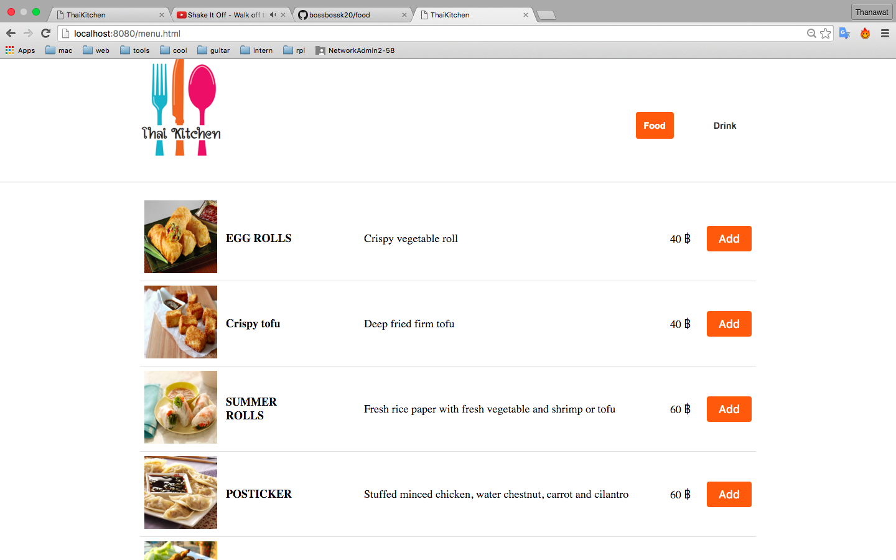

# how to use
> $ git clone https://github.com/bossbossk20/food.git

# how to run
>$ npm install http-server -g

>$ http-server

# how test
> $ cd test

> $ node appTest  

##### index.html

##### menu.html

